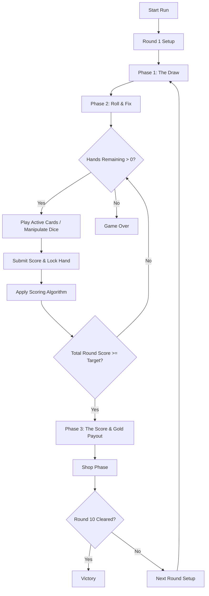

# Roll of the Draw: Game Design Document & Product Requirements Document (PRD)

Welcome to the official Game Design Document (GDD) and Product Requirements Document (PRD) for **Roll of the Draw**, a browser-based, rogue-lite deckbuilder that blends dice manipulation, poker-hand scoring, and passive synergies.

---

## 1. Game Overview & Vision

### 1.1 Core Concept
**Roll of the Draw** is a single-player, run-based deckbuilder where the traditional deck of cards is replaced with two distinct components:
1. **Active Cards**: Action-oriented cards used to manipulate a set of five dice.
2. **Passive Upgrades (Jokers)**: Persistent modifiers that alter scoring calculations, resource generation, and general game rules.

Instead of drawing cards to play them directly for points, the player rolls five standard dice and uses their hand of Active Cards to physically alter the values, duplicates, and states of those dice to engineer high-scoring poker hands.

### 1.2 Theme & Visual Identity
The game eschews modern sci-fi grids, lasers, and vaporwave neon in favor of a **Tactile Casino Experience** that prioritizes textured, physical realism:
* **The Canvas**: A deep, rich forest-green felt casino table serving as the primary backdrop for all gameplay areas.
* **The Elements**: Heavy ivory dice with deeply indented dark-colored pips, thick-textured matte card stock for active cards, and dark mahogany wood borders for the UI panels.
* **Micro-Animations**: Smooth, physical-feeling card draws, satisfying tactile dice tumbling, gold coins clinking, and a responsive rolling scoreboard incrementer (reminiscent of slot machine counters).

---

## 2. Gameplay Loop & Core Mechanics

The game progresses through a sequence of **10 Rounds** with increasing target score thresholds. Each round consists of three phases, followed by a transition to the shop.



### 2.1 The Round Loop

#### Phase 1: The Draw
* At the start of each round, the player's active hand is filled up to **5 cards** from their active deck.
* Unplayed active cards from previous rounds are retained in the player's hand, enabling strategic hoarding of key utility cards for subsequent, harder rounds.

#### Phase 2: The Roll & Fix
* The player is given a single initial roll of **5 six-sided dice** (values 1–6).
* The player starts each hand with **3 Energy** (unless modified by passive upgrades).
* Active Cards can be played from the hand by spending their specified Energy cost to alter the values of the dice on the table.
* The player is given **5 attempts ("Hands")** per round to cumulatively reach the Round's target score. For each hand, the player can spend energy, play cards, and submit a final dice configuration to add to their round score.

#### Phase 3: The Score & Gold Payout
* Once the player is satisfied with their dice configuration for a hand, they submit the hand.
* The 5-dice configuration is evaluated as a poker hand, applying base values and active/passive modifiers.
* When the cumulative round score meets or exceeds the Round's target score, the round is successfully cleared.
* Beating a round awards the player **Gold ($)** based on their performance:
  * **Base Payout**: A fixed reward for clearing the round.
  * **Efficiency Bonus**: **+$1 Gold** for every unit of unspent Energy remaining at the end of the round.
  * **Interest Bonus**: **+$1 Gold** for every **$5 Gold** currently held in the wallet, capped at a maximum of **+$5 Gold** (achieved at $25 Gold).

---

## 3. In-Game Economy & Shop Phase

Between rounds, players enter the **Shop** to spend their hoarded Gold on upgrades to strengthen their deck and passive slots before the next round begins.

* **Inventory Generation**: The shop automatically rolls a random selection consisting of:
  * **3 Active Cards** (to add to the draw deck, increasing capabilities and options).
  * **2 Jokers** (to fill or swap into the 5 passive synergy slots).
* **Reroll Mechanic**: Players can spend gold to reroll the shop's inventory to search for specific synergies.
* **Passive Slot Limit**: Players are strictly limited to equipping a maximum of **5 Jokers** at any given time. If a 6th Joker is purchased, the player must sell one of their currently equipped Jokers.

---

## 4. Scoring Algorithm & Hand Values

The scoring system evaluates the 5-dice array to determine the highest possible poker hand. The core logic is structured as a deterministic reducer:

$$\text{Final Hand Score} = (\text{Base Hand Chips} + \text{Bonus Chips}) \times (\text{Base Hand Mult} + \text{Bonus Mult})$$

### 4.1 Base Poker Hand Values (Dice-Based)

Since the game uses five standard 6-sided dice rather than a 52-card deck, poker hands are redefined as follows:

| Hand Type | Description | Base Chips | Base Mult |
| :--- | :--- | :---: | :---: |
| **Five-of-a-Kind** | All 5 dice show the identical face value (e.g., `6, 6, 6, 6, 6`). | 120 | 12x |
| **Large Straight** | A consecutive sequence of 5 values (`1-2-3-4-5` or `2-3-4-5-6`). | 100 | 10x |
| **Four-of-a-Kind** | 4 dice show the identical face value (e.g., `3, 3, 3, 3, 5`). | 80 | 8x |
| **Full House** | 3 dice of one value and 2 dice of another (e.g., `4, 4, 4, 2, 2`). | 60 | 6x |
| **Small Straight** | A consecutive sequence of 4 values (e.g., `1-2-3-4-x` or `2-3-4-5-x`). | 50 | 5x |
| **Three-of-a-Kind**| 3 dice show the identical face value (e.g., `5, 5, 5, 1, 2`). | 40 | 4x |
| **Two Pair** | 2 dice of one value and 2 dice of another value (e.g., `6, 6, 2, 2, 5`). | 30 | 3x |
| **Pair** | 2 dice show the identical face value (e.g., `1, 1, 3, 4, 6`). | 10 | 2x |
| **High Card** | None of the above combinations are met (no matching values or straights). | 5 | 1x |

### 4.2 Scoring Reducer Pipeline

1. **Poker Hand Detection**: Identify the highest scoring classification of the 5 active dice faces.
2. **Base Scoring**: Retrieve the corresponding `Base Chips` and `Base Mult`.
3. **Die Face Values**: Sum the face values of the dice that participate in the poker hand (or all dice for High Card/Straights) and add them to the chips.
4. **Joker Modifier Evaluation**: Apply passive Joker triggers in sequence to modify both the chips and multiplier totals.
5. **Final Computation**: Multiply the final chip sum by the final multiplier sum.

---

## 5. Active Cards Database

Active cards are drawn into the hand, cost Energy to play, and are spent upon execution. 

| ID | Card Name | Type | Cost (Energy) | Color Hex | Effect Description |
| :---: | :--- | :---: | :---: | :---: | :--- |
| **1** | Nudge Up | Math | 1 | `#4a9eff` | Add +1 to a selected die. (Capped at 6) |
| **2** | Nudge Down | Math | 1 | `#4a9eff` | Subtract -1 from a selected die. (Floor at 1) |
| **3** | Flip | Logic | 1 | `#9b6dff` | Turn a selected die to its exact opposite face (e.g., 1↔6, 2↔5, 3↔4). |
| **4** | Re-roll Single | RNG | 1 | `#ff9b4a` | Re-roll one selected die on the board. |
| **5** | Re-roll All | RNG | 2 | `#ff9b4a` | Pick up and re-roll all 5 dice currently on the table. |
| **6** | Duplicate | Clone | 2 | `#4aff9b` | Select a source die, then apply its exact value to a second selected die. |
| **7** | Lock & Load | RNG | 2 | `#ff9b4a` | Lock 2 chosen dice in place, and re-roll the remaining 3 dice. |
| **8** | Max Out | Force | 1 | `#ffd700` | Force a selected die to instantly become a 6. |
| **9** | Bottom Out | Force | 1 | `#ffd700` | Force a selected die to instantly become a 1. |
| **10** | Evens Bias | RNG | 1 | `#ff9b4a` | Re-roll a selected die; it is guaranteed to land on an even number (2, 4, or 6). |
| **11** | Odds Bias | RNG | 1 | `#ff9b4a` | Re-roll a selected die; it is guaranteed to land on an odd number (1, 3, or 5). |
| **12** | Wildcard | Logic | 2 | `#9b6dff` | Change a selected die to a "Wild" face (or select any face value 1–6). |
| **13** | Snake Eyes | Force | 1 | `#ffd700` | Select two dice; force both of them to become 1s. |
| **14** | Boxcars | Force | 2 | `#ffd700` | Select two dice; force both of them to become 6s. |
| **15** | The Squeeze | Math | 2 | `#4a9eff` | Apply either +1 or -1 to ALL dice currently on the board. |
| **16** | Mirror | Clone | 1 | `#4aff9b` | Copy the value of the far-left (first) die and apply it to the far-right (fifth) die. |
| **17** | Draw Two | Draw | 1 | `#ff4a9b` | Draw 2 additional cards from your deck into your hand this turn. |
| **18** | Energy Drink | Utility | 0 | `#a0ff4a` | Discard 1 card from your hand to instantly gain 1 Energy. |
| **19** | Substitute | Utility | 1 | `#a0ff4a` | Destroy 1 die completely and roll a fresh, new die in its place. |
| **20** | Clairvoyance | Draw | 1 | `#ff4a9b` | Reveal the top 3 cards of your deck. Choose 1 to draw into your hand. |

---

## 6. Passive Upgrades (Jokers) Database

Jokers sit on the table passively, cost no Energy to trigger, and define the core "engine building" and scoring power of a run.

| ID | Joker Name | Trigger Type | Color Hex | Passive Bonus / Rule Modification |
| :---: | :--- | :---: | :---: | :--- |
| **1** | The High Roller | Per Die | `#ffd700` | Grants **+3 Multiplier** for every '6' included in the scored hand. |
| **2** | Lowrider | Per Die | `#ffd700` | Grants **+4 Multiplier** for every '1' included in the scored hand. |
| **3** | Even Steven | Hand Rule | `#4aff9b` | **+50 Base Chips** if the submitted hand contains exclusively even numbers. |
| **4** | Oddball | Hand Rule | `#4aff9b` | **+50 Base Chips** if the submitted hand contains exclusively odd numbers. |
| **5** | Straight Shooter | Poker Hand | `#9b6dff` | **+12 Multiplier** whenever a Small Straight or Large Straight is scored. |
| **6** | Pair Bond | Poker Hand | `#9b6dff` | Pairs and Two-Pairs grant a flat **+20 Base Chips** on top of standard score. |
| **7** | Three's Company | Poker Hand | `#9b6dff` | The base score of any Three-of-a-Kind hand triggers twice. |
| **8** | Junk Dealer | Poker Hand | `#ff9b4a` | Scoring a standard "High Card" (no poker pairs/straights) grants **+300 Base Chips**. |
| **9** | Royal Flush | Poker Hand | `#ff4a4a` | Five-of-a-Kinds grant a massive **+500 Base Chips** and **+50 Multiplier**. |
| **10** | Full House Fanatic | Scaling | `#9b6dff` | Starts at +1 Multiplier. Increases by **+1 Multiplier** permanently every time a Full House is played. |
| **11** | Energy Saver | Economy | `#a0ff4a` | Unspent Energy at round end yields **+$2 Gold** instead of the standard +$1. |
| **12** | Card Counter | Hand Rule | `#4a9eff` | Grants **+1 Multiplier** for every Active Card held in your hand when scoring. |
| **13** | Discard Synergy | Hand Rule | `#4a9eff` | **+10 Base Chips** for every card played or discarded during this Round. |
| **14** | The Underdog | Score State | `#ff9b4a` | **+20 Multiplier** if your current score is less than 10% of the Round's target. |
| **15** | Rich Get Richer | Economy | `#a0ff4a` | Grants **+1 Multiplier** for every **$10 Gold** currently held in your wallet. |
| **16** | Golden Die | RNG | `#ffd700` | One random die face becomes "Golden" per hand. Scoring it grants **+50 Base Chips**. |
| **17** | Four-Leaf Clover | Utility | `#4aff9b` | Grants **+1 free total board re-roll** per hand (costs 0 energy). |
| **18** | The Escalator | Scaling | `#9b6dff` | Multiplier increases by **+1** for each consecutive hand played within a Round. |
| **19** | Stubborn Mule | Scaling | `#ff9b4a` | Grants **+5 Multiplier** if you score the exact same poker hand type twice in a row. |
| **20** | The Scrapper | Economy | `#a0ff4a` | Immediately gain **$1 Gold** to your wallet every time you play an Active Card. |

---

## 7. Technical Specifications & Architecture

### 7.1 Tech Stack Justification
* **Core Framework**: **React + Vite** - Lightweight SPA setup allowing rapid hot-module reloading and modular component architecture.
* **Styling**: **Tailwind CSS** - Ideal for building custom layouts, card shapes, flexbox board wrappers, and responsive scaling constrained to a 16:9 canvas aspect ratio.
* **State Management**: **Zustand** - A lightweight, hook-based global state manager to coordinate run states, wallet totals, decks, active hands, and the 5 equipped Joker slots without unnecessary re-renders.
* **Animations**: **Framer Motion** - Essential for rendering visual feedback, including card flips, shuffling/dealing, dice tumbling, and scoreboard count-ups.

### 7.2 State Management Diagram (Zustand Store)

```
                       ┌────────────────────────┐
                       │      Zustand Store     │
                       └───────────┬────────────┘
                                   │
         ┌─────────────────────────┼────────────────────────┐
         ▼                         ▼                        ▼
┌──────────────────┐     ┌──────────────────┐     ┌──────────────────┐
│    Run State     │     │     Resources    │     │  Deck & Hand     │
├──────────────────┤     ├──────────────────┤     ├──────────────────┤
│ Round: 1-10      │     │ Wallet ($)       │     │ Draw Pile (Array)│
│ Hands Left: 1-5  │     │ Energy (0-3)     │     │ Active Hand (Arr)│
│ Target Score     │     │ Interest Base    │     │ Discard Pile(Arr)│
│ Current Score    │     │                  │     │ Equipped Jokers  │
└──────────────────┘     └──────────────────┘     └──────────────────┘
```

### 7.3 Game State Transition Flow
1. **Play Active Card Action**:
   * Deduct card energy from player's current energy.
   * Modify dice array or trigger drawing/rng actions based on card ID.
   * Append to the round play/discard counter (for cards like *Discard Synergy*).
   * Evaluate state transitions (e.g., if Energy reaches 0 or if dice changes are done).
2. **Submit Hand Action**:
   * Run the dice values through the hand analyzer to determine the base hand.
   * Trigger passive Joker calculations (add chips, increment multipliers, check scaling Jokers).
   * Increment cumulative round score.
   * Reset Energy to 3, clear dice states, and draw new active cards (up to 5).
   * Deduct 1 attempt from Hands Left.
   * Check victory/defeat criteria:
     * If `Cumulative Score >= Target Score`: Transition to **Round Clear Screen**, distribute Gold, and open the **Shop Phase**.
     * If `Cumulative Score < Target Score` and `Hands Left == 0`: Transition to **Game Over Screen**.
     * Otherwise: Setup the board for the next hand.
